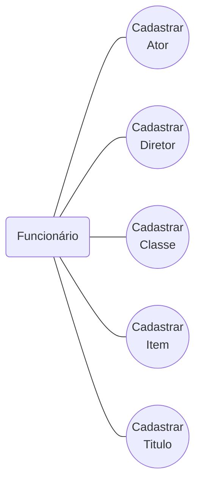
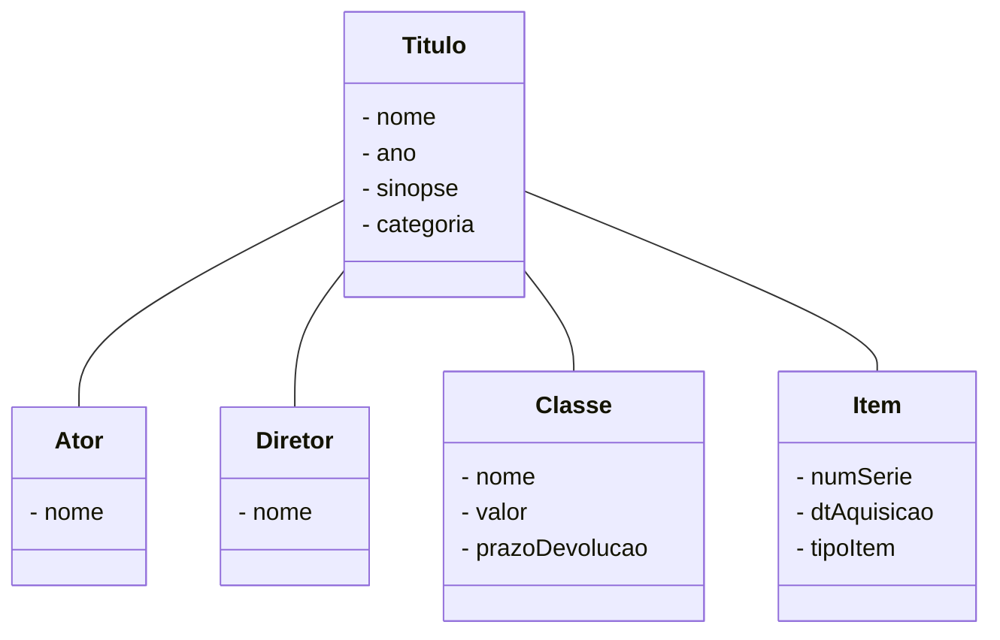

# Locadora

### Para rodar o frontend:
```
npm install
```
```
cd locadora-frotend
```
```
npm run ng serve
```


## Casos de uso


### Cadastrar Ator
  * **Descrição**: Este caso de uso é responsável pelo controle de atores, abrangendo a inclusão de um novo ator, alteração e exclusão.   
  * **Curso normal:**   
    ***Incluir novo ator***    
    &emsp; `O funcionário informa o nome do ator.`   
    &emsp; `Após isso, as informações são registradas.`    
    ***Alterar dados do ator***    
    &emsp; `O funcionário informa o ator do qual deseja alterar dados e os novos dados.`   
    &emsp; `Os novos dados são validados e a alteração registrada.`   
    ***Excluir ator***   
    &emsp; `O funcionário informa o ator que deseja excluir.`   
    &emsp; `É solicitada uma confirmação. Se a exclusão for confirmada, o ator é excluído.`   
    &emsp; `Não é permitida a exclusão de um ator relacionado a títulos.`   

### Cadastrar Classe
  * **Descrição**: Este caso de uso é responsável pelo controle de classes, abrangendo a inclusão de uma nova classe, alteração e exclusão.   
  * **Curso normal:**   
    ***Incluir novo ator***    
    &emsp; `O funcionário informa o nome, valor e data de devolução da classe.`   
    &emsp; `Após isso, as informações são registradas.`    
    ***Alterar dados do ator***    
    &emsp; `O funcionário informa o ator do qual deseja alterar dados e os novos dados.`   
    &emsp; `Os novos dados são validados e a alteração registrada.`   
    ***Excluir ator***   
    &emsp; `O funcionário informa a classe que deseja excluir.`   
    &emsp; `É solicitada uma confirmação. Se a exclusão for confirmada, a classe é excluída.`   
    &emsp; `Não é permitida a exclusão de uma classe relacionada a títulos.`   

### Cadastrar Diretor
  * **Descrição**: Este caso de uso é responsável pelo controle de diretores, abrangendo a inclusão de um novo ator, alteração e exclusão.   
  * **Curso normal:**   
    ***Incluir novo diretor***    
    &emsp; `O funcionário informa o nome do diretor.`   
    &emsp; `Após isso, as informações são registradas.`    
    ***Alterar dados do diretor***    
    &emsp; `O funcionário informa o diretor do qual deseja alterar dados e os novos dados.`   
    &emsp; `Os novos dados são validados e a alteração registrada.`   
    ***Excluir diretor***   
    &emsp; `O funcionário informa o diretor que deseja excluir.`   
    &emsp; `Se a exclusão for confirmada, o diretor é excluído.`   
    &emsp; `Não é permitida a exclusão de um diretor relacionado a títulos.`   

### Cadastrar Título
  * **Descrição**: Este caso de uso é responsável pelo controle de títulos, abrangendo a inclusão de um novo título, alteração, consulta e exclusão de títulos existentes.   
  * **Curso normal:**   
    ***Incluir novo título***    
    &emsp; `O funcionário informa os dados do novo título, incluindo: nome, atores, diretor, ano, sinopse, categoria e classe.`   
    &emsp; `Caso os dados sejam válidos, as informações são registradas.`    
    ***Alterar dados do título***    
    &emsp; `O funcionário informa o título do qual deseja alterar dados e os novos dados.`   
    &emsp; `Os novos dados são validados e a alteração registrada.`   
    ***Consultar dados do título***   
    &emsp; `O funcionário informa o título que deseja consultar.`   
    &emsp; `Os dados do título são apresentados.`   
    ***Excluir título***   
    &emsp; `O funcionário informa o título que deseja excluir.`   
    &emsp; `É solicitada uma confirmação. Se a exclusão for confirmada, o título é excluído.`   
    &emsp; `Não é permitida a exclusão de um título que possua itens.`   
    &emsp; `Na exclusão de um título, devem ser excluídas as reservas feitas para o mesmo.`   

### Cadastrar Item
  * **Descrição**: Este caso de uso é responsável pelo controle de itens (fitas ou DVDs), abrangendo a inclusão, alteração, consulta e exclusão de itens.  
  * **Curso normal:**   
    ***Incluir novo item***    
    &emsp; `O funcionário informa os dados do novo item, incluindo: número de série, título, data de aquisição e tipo (fita, DVD ou BlueRay).`   
    &emsp; `Caso os dados sejam válidos, o novo item é registrado.`    
    ***Alterar dados do item***    
    &emsp; `O funcionário informa o item da qual deseja alterar dados e os novos dados`   
    &emsp; `Os novos dados são validados e a alteração registrada.`   
    ***Excluir item***   
    &emsp; `O funcionário informa o item que deseja excluir`   
    &emsp; `É solicitada confirmação. Se a exclusão for confirmada, o item é excluído`   
    &emsp; `Não é permitida a exclusão de um item que possua locações.`   

## Diagrama de Classe

